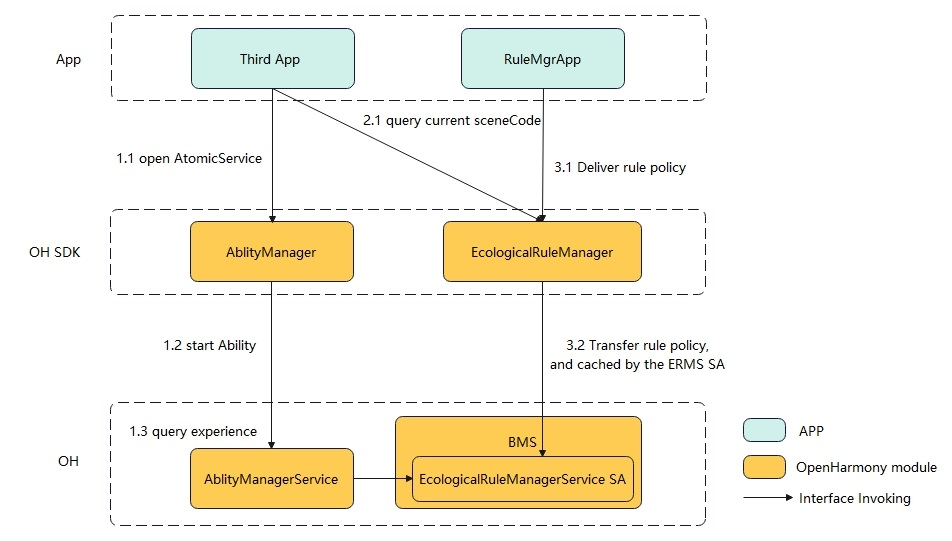

# bundlemanager_ecological_rule_manager

### Introduction
The ecological rule manager service provides a system extension capability, where device manufacturers can control the behavior of applications (such as jumping, adding desktop cards, and installing atomic services) on customized devices (such as 2B cooperation projects), thereby customizing user experiences that meet the manufacturer's control requirements.

### Software Architecture


The following describes the key fields in the preceding figure:

- `App`: App will be managed by ecological rule manager service when opening atomic services.
- `AbilityManagerService`: AbilityManagerService is a system service used to coordinate the operational relationships of various capabilities and schedule the lifecycle.
- `FormManagerService`: FormManagerService is responsible for managing the lifecycle of cards, maintaining card information, and scheduling card events.
- `BundleManagerService`: BundleManagerService is responsible for managing application installation packages, providing capabilities such as querying, installing, updating, uninstalling, and storing package information for installation packages.
- `EcologicalRuleManagerService`: EcologicalRuleManagerService is responsible for managing behaviors such as pulling up and adding tables of atomic services.

### Directory Structure

```shell
/foundation/bundlemanager/ecological_rule_mgr       # EcologicalRuleManagerService code
├── etc                                             
│   └── init                                        # SA startup configuration file
├── interfaces                                      # Interface Code
│   └── innerkits                                   # Internal interface
├── profile                                         # Service Profile
├── services                                        # Service Code
├── LICENSE                                         # Certificate file
├── tests                                           # Developer test
└── utils                                           # Tools
```
### build

In the root directory of the OpenHarmony source code, invoke the following command to compile ecological_rule_manager:
```shell
./build.sh --product-name rk3568 --ccache --build-target ecological_rule_manager
```
> **Note:**
--product-name: product name, for example, Hi3516D V300 or rk3568.
--ccache: The cache function is used during compilation.
--build-target: name of the compiled component.

### Interface Usage Description
The ecological rule manager service only opens internal interfaces to system services, and the system can expand the interface functions according to actual needs.
|interface|description|
|---|---|
|QueryStartExperience(const Want &want, const CallerInfo &callerInfo, ExperienceRule &rule)：int32_t|This interface is provided for AbilityManagerService and invoked when the atomic services is enabled. ExperienceRule is a return value, indicating whether the atomic services can be opened, the specific experience Want can be returned when the value is not allowed.|
|QueryFreeInstallExperience(const Want &want, const CallerInfo &callerInfo ExperienceRule &rule)：int32_t|This interface is provided for BundleManagerService and invoked when the atomic service is installation-free. This parameter is used to determine whether installation-free is allowed, the specific experience Want can be returned when installation-free is not allowed.|
|IsSupportPublishForm(const vector<AAFwk::Want> &wants, const CallerInfo &callerInfo, bool &bSupport)：int32_t|This interface is provided for FormManagerService and invoked when cards are added to tables, which is used to determine whether atomic services can be added to table.|
|EvaluateResolveInfos(const Want &want, const CallerInfo &callerInfo, int32_t type,std::vector<AbilityInfo> &abilityInfos)：int32_t|This interface is provided for AbilityManagerService to filter out prohibited providers.|