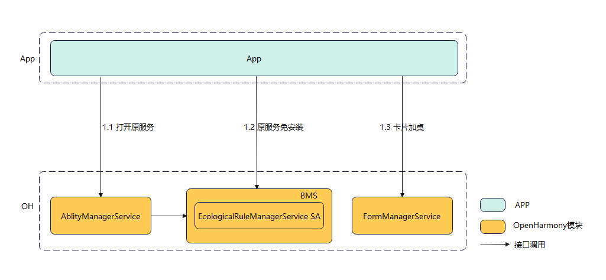

# bundlemanager_ecological_rule_manager

### 简介
生态规则管控服务提供一种系统的扩展能力，设备厂商可以在定制设备上（2B合作项目等），对应用的行为（跳转、添加桌面卡片、免安装元服务）进行管控，从而定制出满足厂商管控要求的用户体验。


### 软件架构


以下是对于上图关键字段的描述信息：

- `App`：App，在打开元服务时会受到生态规则服务的管控。
- `AbilityManagerService`：元能力管理服务，用于协调各Ability运行关系、及对生命周期进行调度的系统服务。 
- `FormManagerService`：卡片管理服务，管理卡片的生命周期，并维护卡片信息以及卡片事件的调度。
- `BundleManagerService`：包管理服务，负责应用安装包的管理，提供安装包的信息查询、安装、更新、卸载和包信息存储等能力。
- `EcologicalRuleManagerService`：生态规则管控服务，对元服务的拉起，加桌等行为进行管控。


### 目录结构

```shell
/foundation/bundlemanager/ecological_rule_mgr       # 生态规则管控服务业务代码
├── etc                                             
│   └── init                                        # SA启动配置文件
├── interfaces                                      # 接口代码
│   └── innerkits                                   # 内部接口
├── profile                                         # 服务配置文件
├── services                                        # 服务代码
├── LICENSE                                         # 证书文件
├── tests                                           # 开发者测试
└── utils                                           # 工具类
```
### 编译构建

在OpenHarmony源码根目录下，调用以下指令，单独编译ecological_rule_manager。
```shell
./build.sh --product-name rk3568 --ccache --build-target ecological_rule_manager
```
> **说明：**
--product-name：产品名称，例如Hi3516DV300、rk3568等。
--ccache：编译时使用缓存功能。
--build-target: 编译的部件名称。

### 接口使用说明
生态规则管控服务只对系统服务开放内部接口，系统根据实际需要进行接口功能扩展。
|接口|说明|
|---|---|
|QueryStartExperience(const Want &want, const CallerInfo &callerInfo, ExperienceRule &rule)：int32_t|提供给AbilityManagerService使用，在元服务打开时调用。ExperienceRule为返回值，返回是否允许打开；不允许时可以返回具体的体验Want。|
|QueryFreeInstallExperience(const Want &want, const CallerInfo &callerInfo ExperienceRule &rule)：int32_t|提供给BundleManagerService使用，在元服务免安装时调用。用于判断是否允许免安装，不允许时可以返回具体的体验Want。|
|IsSupportPublishForm(const vector<AAFwk::Want> &wants, const CallerInfo &callerInfo, bool &bSupport)：int32_t|提供给FormManagerService使用，在卡片加桌时调用。用于判断是否允许加桌|
|EvaluateResolveInfos(const Want &want, const CallerInfo &callerInfo, int32_t type,std::vector<AbilityInfo> &abilityInfos)：int32_t|提供给AbilityManagerService使用，支持过滤掉禁止出现的提供者|

